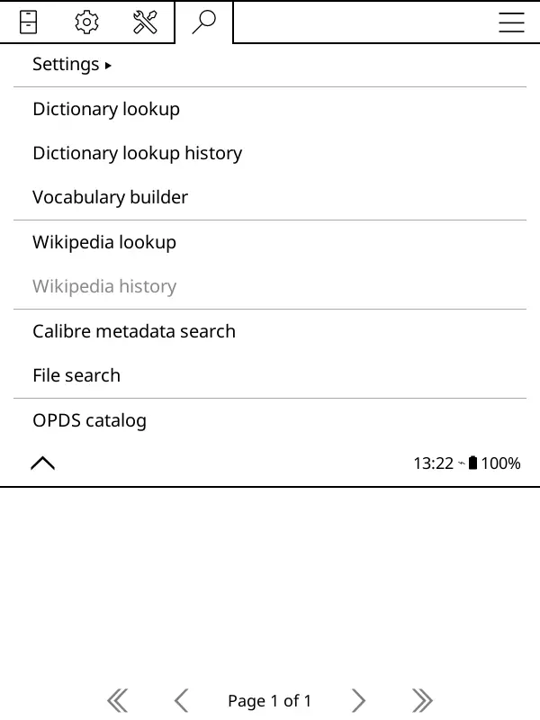

# E-Book-Katalog

Readeck bietet einen E-Book-Katalog aller Ihrer Lesezeichen, organisiert in einem Katalog mit der folgenden Struktur:

- Ungelesene Lesezeichen
- Archivierte Lesezeichen
- Lieblingslesezeichen
- Alle Lesezeichen
- Lesezeichensammlungen
  - (Sammlung Name)
    - Sammlung E-Book
    - Sammlung durchsuchen

Jeder Abschnitt mit Ausnahme der Sammlungen stellt jedes Lesezeichen als E-Book bereit.

Im Bereich einer Sammlung können Sie die gesamte Sammlung als einzelnes E-Book herunterladen.

## Katalogzugriff

Auf den Katalog kann mit jeder App oder jedem E-Reader zugegriffen werden, der das OPDS-Format unterstützt.
Um Zugriff auf den Katalog zu gewähren, müssen Sie zunächst ein [Anwendungskennwort](readeck-instance://profile/credentials) erstellen.

Sie können die Berechtigung dieses Passworts auf „Lesezeichen: Nur Lesen“ beschränken.
Notieren Sie sich Ihr Passwort und richten Sie Ihre App ein.

Die URL Ihres OPDS-Katalogs lautet: \
[readeck-instance://opds](readeck-instance://opds)

## Beispiel-Setup: Koreader

[Koreader](https://koreader.rocks/) ist ein Dokumentenbetrachter für E-Ink-Geräte. Es ist für Kindle, Kobo, PocketBook, Android und Desktop-Linux verfügbar. Es verfügt über eine sehr gute OPDS-Unterstützung.

Sobald Sie ein Anwendungspasswort haben, können Sie im Suchmenü von Koreader auf den OPDS-Bereich zugreifen:

Dieser Abschnitt zeigt eine Liste vorkonfigurierter OPDS-Quellen und Sie können Ihre hinzufügen, indem Sie auf das „+“-Symbol in der oberen linken Ecke klicken:

Ersetzen Sie in diesem Dialog die folgenden Felder durch:

- https://readeck.example.com : `readeck-instance://opds`
- alice: Ihr Benutzername
- Geben Sie im letzten Feld Ihr Bewerbungspasswort ein

Sie können jetzt über Koreader auf Ihre Lesezeichen zugreifen!

