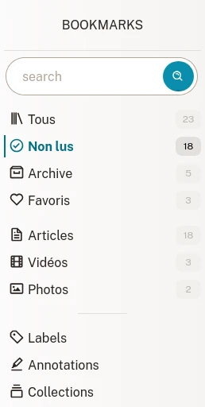
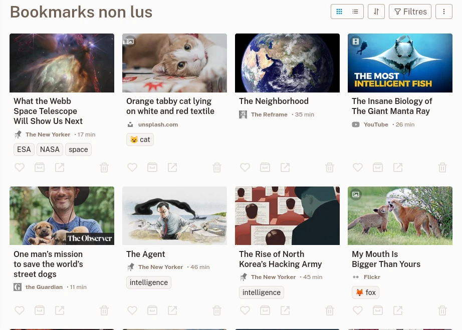
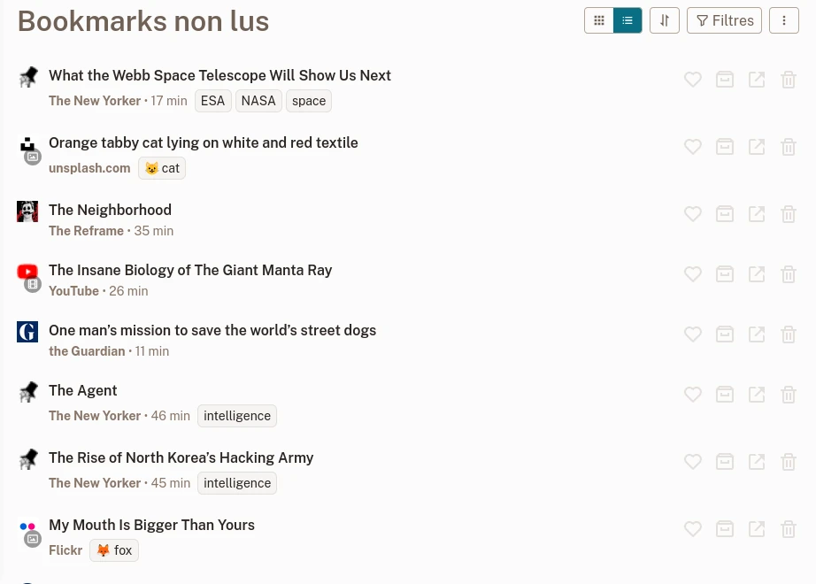
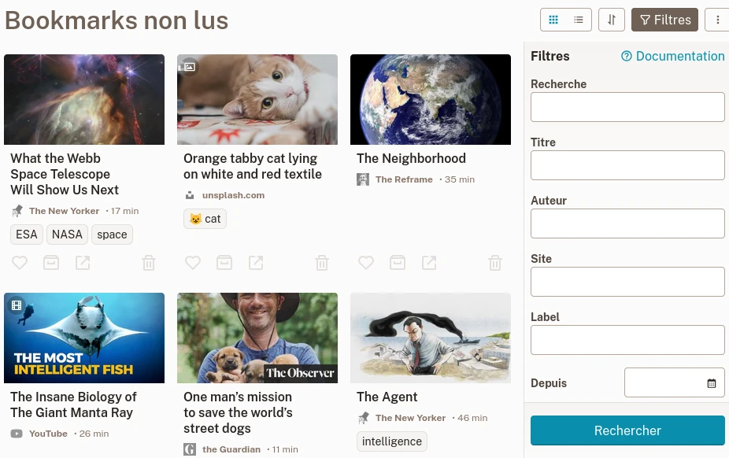

# Bookmarks

Dans les bookmarks se trouve le contenu web que vous appréciez.

## Créer un bookmark

Vous avez trouvé une page que vous aimez ? Parfait, copiez son adresse (lien) dans le champ texte nommé **Enregistrer un lien** sur la [liste des bookmarks](readeck-instance://bookmarks).

Après quelques secondes, votre bookmark est prêt. Vous pouvez l'ouvrir pour en consulter le contenu, ajouter des labels, annoter le texte ou exporter un e-book. Pour plus d'information, veuillez lire la section [Détails d'un bookmark](./bookmark).

## Types de bookmark

Readeck reconnaît 3 différents types de contenu web :

### Article

Un article est une page depuis laquelle on peut extraire un contenu text. L'article est affiché comme la version lisible de son contenu.

### Photo

Une photo est une page qui a été reconnue comme un conteneur pour une image (ex. un lien vers Unsplash). Le bookmark affiche l'image enregistée.

### Vidéo

Une vidéo est une page qui a été reconnue comme un conteneur pour une vidéo (ex. un lien vers Youtube ou Vimeo). Le bookmark affiche un lecteur de vidéo. Veuillez noter que les vidéos sont jouées depuis le serveur d'origine.

## Liste des bookmarks

La [liste des bookmarks](readeck-instance://bookmarks) contient tous vos bookmarks.

### Navigation

Dans la barre latérale, se trouvent un champ de recherche et des liens qui vous mènent vers des listes de bookmarks déjà filtrées.

- **Recherche** \
  Indiquez ce que vous cherchez (titre, contenu, site web...)
- **Tous** \
  Tous vos bookmarks.
- **Non lus** \
  Les bookmarks qui ne sont pas dans l'archive.
- **Archive** \
  Les bookmarks marqués comme archivés.
- **Favoris** \
  Les bookmarks marqués comme favoris.

Dès que vous commencez à créer des bookmarks, vous verrez les liens suivants :

- **Articles** \
  Les articles
- **Vidéos** \
  Les vidéos
- **Photos** \
  Les photos et images

Enfin, se trouvent 3 autres sections qui mènent vers des pages liées aux bookmarks :

- **[Labels](./labels.md)** \
  Tous les labels ajoutés aux bookmarks
- **Annotations** \
  Toutes les annotations ajoutées aux bookmarks
- **[Collections](./collections.md)** \
  Liste des collections

### Cartes

Chaque élément de la liste des bookmarks est une carte.

Liste des bookmarks en grille

Une carte contient:

- le **title** sur lequel vous pouvez cliquer pour accéder au contenu,
- le **nom du site**,
- le **temps de lecture** estimé,
- la **liste des labels**,
- **boutons d'action**

Les buttons permettent d'effectuer les actions suivantes:

- **Favori** \
  Change l'état favori ou non d'un bookmark.
- **Archive** \
  Archive un bookmark (ou le retire des archives).
- **Supprimer** \
  Marque le bookmark pour suppression (cette action peut être annulée pendant quelques secondes).

### Liste compacte

Si vous trouvez la liste de bookmarks sous forme de grille trop encombrée, vous pouvez changer pour une liste plus compacte contenant moins d'images. Cliquez sur le bouton près du titre pour passer à la vue compacte.

Liste compacte de bookmarks

## Filtrer les bookmarks {#filters}

Sur la liste des bookmarks, vous pouvez filtrer les éléments sur la base de plusieurs critères de recherche. Cliquez sur le bouton "Filtrer la liste" près du titre de la page pour ouvrir le formulaire de recherche.

Le formulaire de recherche

Entrez un ou plusieurs critères et cliquez sur **Rechercher**.

### Filtres disponibles

Vous pouvez combiner les filtres suivants :

- **Recherche**\
  Recherche dans le texte d'un bookmark, son titre, ses auteurs, le nom du site et du domaine et les labels.
- **Titre**\
  Recherche uniquement dans le titre.
- **Auteur**\
  Recherche uniquement dans la liste des auteurs.
- **Site**\
  Recherche uniquement le nom du site ou son domaine.
- **Label**\
  Recherche des labels donnés.
- **Favori**, **Archivé**, **Type**\
  Ce filtre permet de restreindre la recherche sur ces critères.
- **Depuis**, **Jusqu'à**\
  Ces derniers filtres vous permettent de limiter les résultats par date de création des bookmarks. Par example, vous pouvez obtenir la liste des bookmarks créés pendant les 4 dernières semaines mais pas après la dernière semaine.

### Critères de recherche

Les champs **Recherche**, **Titre**, **Auteur**, **Site** et **Label** comprennent les critères de recherche de la même façon :

- `startled cat` trouvera le contenu avec les mots **startled** and **cat**
- `"startled cat"` trouvera le contenu avec la phrase exacte **startled cat** together.
- `cat*` trouvera le contenu avec les mots commençant par **cat** (cat, catnip et caterpillar, par example).
- `-startled cat` trouvera le contenu avec le mot **cat** mais PAS le mot **startled**.

Après avoir effectué une recherche, vous pouvez l'enregistrer en tant que [collection](./collections.md) pour la rendre permanente.

## Exporter et importer des bookmarks

Menu de la liste des bookmarks

### Exporter des bookmarks

Le bouton de menu près des filtres vous permet de télécharger un fichier EPUB de la liste de bookmarks affichée. Il créer un e-book contenant tous les articles organisés en chapitres.

### Importer des bookmarks

Dans le même menu, vous trouverez un lien [Importer des bookmarks](readeck-instance://bookmarks/import). Il vous mènera à un assistant vous permettant d'importer des liens existants depuis différentes sources.
