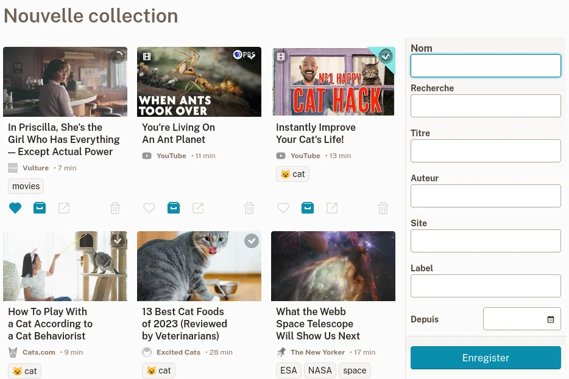

# Collections

Les collections vous permettent de facilement organiser et exporter vos bookmarks en enregistrant les critères de recherche de votre choix.

Quand vous créez un bookmark qui correspond aux critères d'une collection, il apparaîtra immédiatement.

Voici quelques exemples :

- Les articles non lus (pas de photo ou de vidéo),
- Les articles archivés de "wikipedia.org",
- Les photos avec le label "chat",
- The articles qui contiennent "climat" dans leur titre.

## Créer une collection

Pour créer une collection, rendez-vous sur la [liste des collections](readeck-instance://bookmarks/collections) et cliquez sur **Créer une collection**.

Le formulaire de nouvelle collection

Indiquez les critères de recherche et cliquez sur **Enregistrer**.

Veuillez noter que si vous souhaitez chercher un texte exact, vous devez l'indiquer entre guillemets.\
Par exemple, si vous souhaitez chercher le label **chat surpris**, entrez **"chat surpris"** dans le champ **label**.

Les filtres, comme les labels ou les auteurs, peuvent contenir plusieurs valeurs séparées par des espaces.

## Exporter une collection

Sur la page d'une collection vous pouvez exporter la collection complète dans un fichier.

Pour le moment, seul le format EPUB est disponible et exporte la collection sous la forme d'un e-book unique.

## Supprimer une collection

Sur la page d'une collection, ouvrez la boite **Modifier** et cliquez sur **Supprimer**.

Cette opération peut être annulée pendant quelques secondes, au cas où vous auriez fait une erreur.
